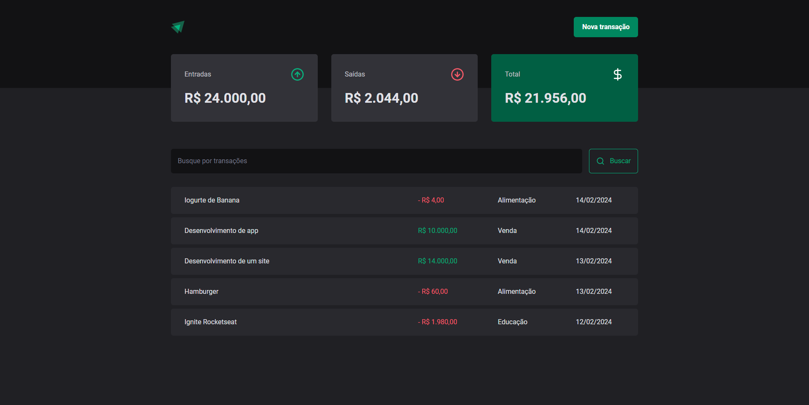

# DT-Money

Terceiro projeto da trilha ReactJS Ignite da [Rocketseat](https://www.rocketseat.com.br/). O DT-Money e um projeto dashboard de controle financeiro aonde é possível acompanhar suas entradas e saídas de dinheiro e ter uma média de entradas, saídas e total.

A ideia desse projeto e aprender a fazer a comunicação do front-end com um back-end utilizando-se uma API RESTful gerado pelo json-server, além de aprender boas praticas e conceitos a respeito de performance no React.

O projeto inicialmente originalmente utilizada Styled Component, porém eu acabei desenvolvendo utilizando TailwindCSS.

## Tecnologias Utilizadas
- React 
- Typescript
- TailwindCSS
- Lucide Icons
- React Hook Form
- Zod
- Radix/UI
- Axios
- json-server
- use-context-selector

## Ferramentas e métodos Utilizadas
- VS Code
- Figma
- Commit atômico / por funcionalidade
- Pattern de commit da Conventional Commits (Commits semânticos)

## Funcionalidades
- Cadastrar uma nova entrada ou saída
- Filtrar por Nome ou Categoria
- Mostrar médias de Entrada, Saida e Total gasto

## Instalação
Siga essa serie de passos para fazer a instalação e configuração do DT-Money localmente.
```bash

## Pré-requisitos: Node.js instalado em sua máquina.


# Clone do repositório
git clone https://github.com/LFeli/DT-Money.git .

# Instalação das dependências
npm install

# Executar o Front-end
npm run dev

# Executar o Server-json (Back-end / API)
npm run dev:server

## Obs: Para o funcionamento correto da aplicação, tanto o Front-end quanto o Back-end precisam estar rodando juntos.

```

## Como utilizar o DT-Money?
```bash

# Criar uma nova transação

1. Acesse o botão de 'Nova transação' ( canto superior direito).
2. Preencha o formulário com a Descrição, Preço, Categoria e Tipo referente a transação.
3. Clique em cadastrar.
4. Feche o modal clicando no X ( Canto superior direito em um ícone de X).

# Filtrar uma transação

## Obs: Atualmente e possível apenas efetuar uma filtragem através da descrição e transação de uma transação, entretanto os passos abaixo serão os mesmos.

1. Clique no input de 'Busque uma transação' ( localizado no meio da tela, embaixo dos cards de Entradas, Saídas e Total ).
2. Digite a transação que deseja buscar.
3. Clique no botão escrito 'Buscar'

```

## Demo
Abaixo uma previa de como é o projeto:

